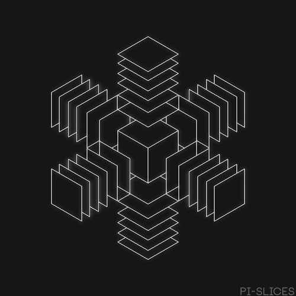
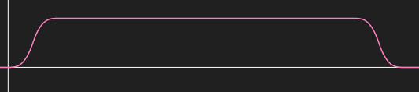
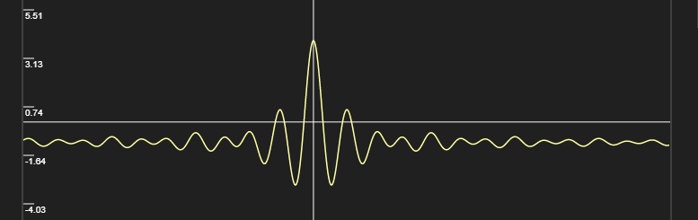

### Homework 3

I did the Cut Cube and the Beaker for HW3.

## Performance Stats:
I tested this on a laptop with a 1050. Both work really fast at around 50-60fps.

## Cut Cube

[Shadertoy Demo](https://www.shadertoy.com/view/4s3czM)

My Render:


Reference:



Initially I was doing some sort of a keyframing. Keyframing results in branching so I reverted to a couple of curves to use as rotation & translation.


Functions:
```
f1 = x<0.5 ? 4.0*x*x*x : (x-1.0)*(2.0*x-2.0)*(2.0*x-2.0)+1.0 // Cubic Ease In Ease Out
Yellow Curve = f2 = clamp(f1(x * 0.7 - 0.15), 0.0, 1.0)

f3 = clamp(x, 0.0, 1.0)
f4 = clamp(-x + 3.75, 0.0, 1.0)
Purple = min(f3(x * 2.0), f4(x * 2.0))
```

I used the Yellow Curve for Rotation. As per the GIF there is a delay for translation and then there is a smooth rotation.
Hence, I offset the curves by some amount so that the Translation (Purple) can complete.

Overall, I warped the time a little more, so that I can fit the curve in my shader.

#### Post Processing

I added Bloom / Glow to the image to make it more close to the gif. Reference: [Shadertoy](https://www.shadertoy.com/view/lsXGWn)

## Bubbling Beaker

[Shadertoy Demo](https://www.shadertoy.com/view/ldcyz8)

My Render:


Reference:


I converted the 3D SDFs on [IQ's Blog](www.iquilezles.org/www/articles/distfunctions/distfunctions.htm) to 2D space and made the beaker. It seems a bit pixelated, but I guess we can alias that.
For The water animation I used a bunch of sin curves with some noise. Bubbles are using another curve for scale up and scale down. I couldn't get the meta-ball like effect for the bubbles (ran out of time).

Bubble Animation Curve:



Functions:
```
f1 = x<0.5 ? 4.0*x*x*x : (x-1.0)*(2.0*x-2.0)*(2.0*x-2.0)+1.0 // Cubic Easing
f3 = min(f1(x), 1.0)
f5 = min(f4(x), 1.0)
f6 = max(0.0, min(f3(x), f5(x)))
```

Liquid Water animation:

The same curve below is used two times and phase shifted.



Functions:
```
f1 = -(sin(3.0*x)/x + 1.0) + (sin(2.0*(x * 2.3))/(x * 2.3) * 4.0)
```
